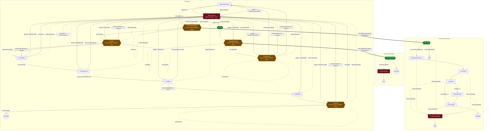

<!-- generated by tools/render_graph.py from `dexcli visualize --json` -->
# Flow graphs

```mermaid
flowchart TD
  subgraph f0_sub["FanyiBook"]
    direction TB
    f0_ApproveItemsStep["ApproveItemsStep"]
    f0_AssembleStep["AssembleStep"]
    f0_CurateWaveStep{{"CurateWaveStep<br/><i>no wait / allOf: SubFlow batch</i>"}}:::gate
    f0_DirectorGate{{"DirectorGate<br/><i>no wait / anyOf: Channel + Timer</i>"}}:::gate
    f0_HarvestStep["HarvestStep"]
    f0_InitStep(["InitStep"]):::start
    f0_PrintStep["PrintStep"]
    f0_ProduceWaveStep{{"ProduceWaveStep<br/><i>no wait / allOf: SubFlow batch</i>"}}:::gate
    f0_ProofGate{{"ProofGate<br/><i>no wait / anyOf: Channel + Timer</i>"}}:::gate
    f0_QaGate{{"QaGate<br/><i>no wait / anyOf: Channel + Timer</i>"}}:::gate
    f0_QualityStep["QualityStep"]
    f0_RecoveryGate["RecoveryGate<br/><i>anyOf: Channel + Timer</i>"]:::recovery
    f0_ProofGate_gracefulComplete(("complete"))
    f0_ProofGate -- "not incomplete" --> f0_ProofGate_gracefulComplete
    f0_ApproveItemsStep -- "staged == 0" --> f0_RecoveryGate
    f0_ApproveItemsStep -- "not staged == 0" --> f0_ProduceWaveStep
    f0_AssembleStep -- "not current.master_md" --> f0_RecoveryGate
    f0_AssembleStep -- "not not current.master_md" --> f0_PrintStep
    f0_CurateWaveStep -. "remainder" .-> f0_CurateWaveStep
    f0_CurateWaveStep -- "not remainder" --> f0_DirectorGate
    f0_DirectorGate -- "frozen.auto_approve" --> f0_ApproveItemsStep
    f0_DirectorGate -. "not decisions" .-> f0_DirectorGate
    f0_DirectorGate -- "decision.decision != 'approve'" --> f0_RecoveryGate
    f0_DirectorGate -- "not decision.decision != 'approve'" --> f0_ApproveItemsStep
    f0_HarvestStep -- "not records" --> f0_RecoveryGate
    f0_HarvestStep -- "not not records" --> f0_AssembleStep
    f0_InitStep --> f0_CurateWaveStep
    f0_PrintStep -- "current.preflight != 'pass'" --> f0_RecoveryGate
    f0_PrintStep -- "not current.preflight != 'pass'" --> f0_QualityStep
    f0_ProduceWaveStep -. "remainder" .-> f0_ProduceWaveStep
    f0_ProduceWaveStep -- "not remainder" --> f0_QaGate
    f0_ProofGate -. "not decisions" .-> f0_ProofGate
    f0_ProofGate -- "decision.decision != 'approve'" --> f0_RecoveryGate
    f0_ProofGate -- "incomplete" --> f0_RecoveryGate
    f0_QaGate -- "frozen.auto_approve" --> f0_HarvestStep
    f0_QaGate -. "not decisions" .-> f0_QaGate
    f0_QaGate -- "decision.decision != 'approve'" --> f0_RecoveryGate
    f0_QaGate -- "not decision.decision != 'approve'" --> f0_HarvestStep
    f0_QualityStep --> f0_ProofGate
    f0_RecoveryGate -. "not messages" .-> f0_RecoveryGate
    f0_RecoveryGate -. "target not in RESUME_TARGETS" .-> f0_RecoveryGate
    f0_RecoveryGate -- "target == INIT" --> f0_InitStep
    f0_RecoveryGate -- "target == CURATING" --> f0_CurateWaveStep
    f0_RecoveryGate -- "target == DIRECTOR_GATE" --> f0_DirectorGate
    f0_RecoveryGate -- "target == APPROVING_ITEMS" --> f0_ApproveItemsStep
    f0_RecoveryGate -- "target == PRODUCING" --> f0_ProduceWaveStep
    f0_RecoveryGate -- "target == QA_GATE" --> f0_QaGate
    f0_RecoveryGate -- "target == HARVESTING" --> f0_HarvestStep
    f0_RecoveryGate -- "target == ASSEMBLING" --> f0_AssembleStep
    f0_RecoveryGate -- "target == PRINTING" --> f0_PrintStep
    f0_RecoveryGate -- "target == CHECKING" --> f0_QualityStep
    f0_RecoveryGate -- "target == PROOF_GATE" --> f0_ProofGate
    f0_RecoveryGate -. "not target == PROOF_GATE" .-> f0_RecoveryGate
    f0_ApproveItemsStep -. "retries exhausted" .-> f0_RecoveryGate
    f0_AssembleStep -. "retries exhausted" .-> f0_RecoveryGate
    f0_CurateWaveStep -. "retries exhausted" .-> f0_RecoveryGate
    f0_DirectorGate -. "retries exhausted" .-> f0_RecoveryGate
    f0_HarvestStep -. "retries exhausted" .-> f0_RecoveryGate
    f0_InitStep -. "retries exhausted" .-> f0_RecoveryGate
    f0_PrintStep -. "retries exhausted" .-> f0_RecoveryGate
    f0_ProduceWaveStep -. "retries exhausted" .-> f0_RecoveryGate
    f0_ProofGate -. "retries exhausted" .-> f0_RecoveryGate
    f0_QaGate -. "retries exhausted" .-> f0_RecoveryGate
    f0_QualityStep -. "retries exhausted" .-> f0_RecoveryGate
    end
  subgraph f1_sub["FanyiCurateChapter"]
    direction TB
    f1_PlanChapterStep(["PlanChapterStep"]):::start
    f1_PlanFailedStep["PlanFailedStep"]:::recovery
    f1_PlanChapterStep_gracefulComplete(("complete"))
    f1_PlanChapterStep --> f1_PlanChapterStep_gracefulComplete
    f1_PlanFailedStep_forceFail(("FAIL"))
    f1_PlanFailedStep --> f1_PlanFailedStep_forceFail
    f1_PlanChapterStep -. "retries exhausted" .-> f1_PlanFailedStep
    end
  subgraph f2_sub["FanyiProduceChapter"]
    direction TB
    f2_AuditStep["AuditStep"]
    f2_DialogueRepairStep["DialogueRepairStep"]
    f2_FinalizeStep["FinalizeStep"]
    f2_Pass1Step(["Pass1Step"]):::start
    f2_Pass2Step["Pass2Step"]
    f2_ProduceFailedStep["ProduceFailedStep"]:::recovery
    f2_RemediateStep["RemediateStep"]
    f2_FinalizeStep_gracefulComplete(("complete"))
    f2_FinalizeStep --> f2_FinalizeStep_gracefulComplete
    f2_Pass1Step_forceFail(("FAIL"))
    f2_Pass1Step -- "not item.get('beats')" --> f2_Pass1Step_forceFail
    f2_ProduceFailedStep_forceFail(("FAIL"))
    f2_ProduceFailedStep --> f2_ProduceFailedStep_forceFail
    f2_AuditStep -- "findings > 0" --> f2_RemediateStep
    f2_AuditStep -- "not findings > 0" --> f2_FinalizeStep
    f2_DialogueRepairStep --> f2_Pass2Step
    f2_Pass1Step -- "not not item.get('beats')" --> f2_DialogueRepairStep
    f2_Pass2Step --> f2_AuditStep
    f2_RemediateStep --> f2_FinalizeStep
    f2_AuditStep -. "retries exhausted" .-> f2_ProduceFailedStep
    f2_DialogueRepairStep -. "retries exhausted" .-> f2_ProduceFailedStep
    f2_FinalizeStep -. "retries exhausted" .-> f2_ProduceFailedStep
    f2_Pass1Step -. "retries exhausted" .-> f2_ProduceFailedStep
    f2_Pass2Step -. "retries exhausted" .-> f2_ProduceFailedStep
    f2_RemediateStep -. "retries exhausted" .-> f2_ProduceFailedStep
    end
  f0_CurateWaveStep ==>|one SubFlow per chapter, bounded batch| f1_PlanChapterStep
  f0_ProduceWaveStep ==>|one SubFlow per chapter, bounded batch| f2_Pass1Step
  classDef start fill:#1f6f3f,stroke:#0d3,color:#fff
  classDef gate fill:#7a4b00,stroke:#fa0,color:#fff
  classDef recovery fill:#6b1220,stroke:#c33,color:#fff
```
